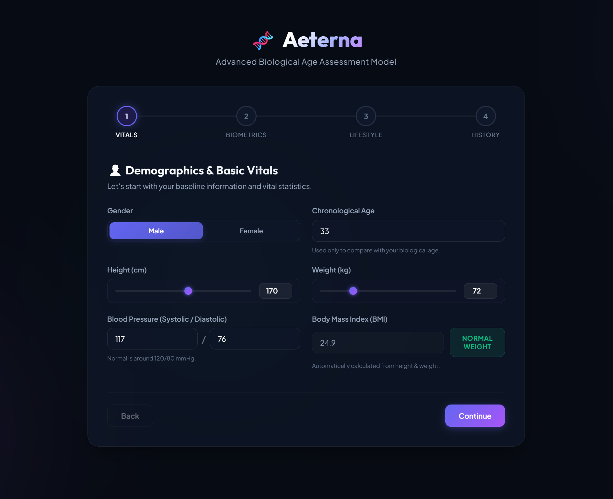
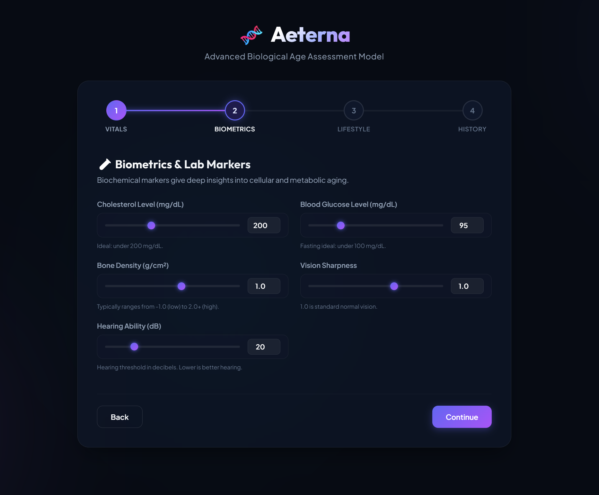
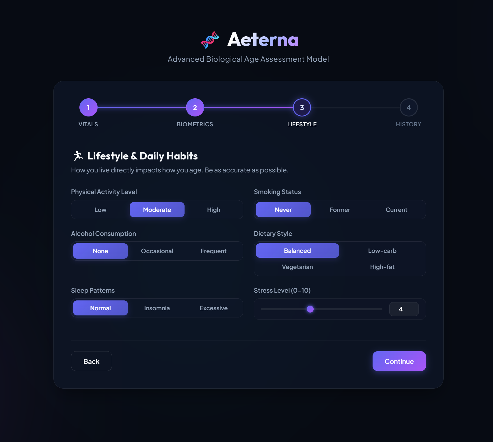
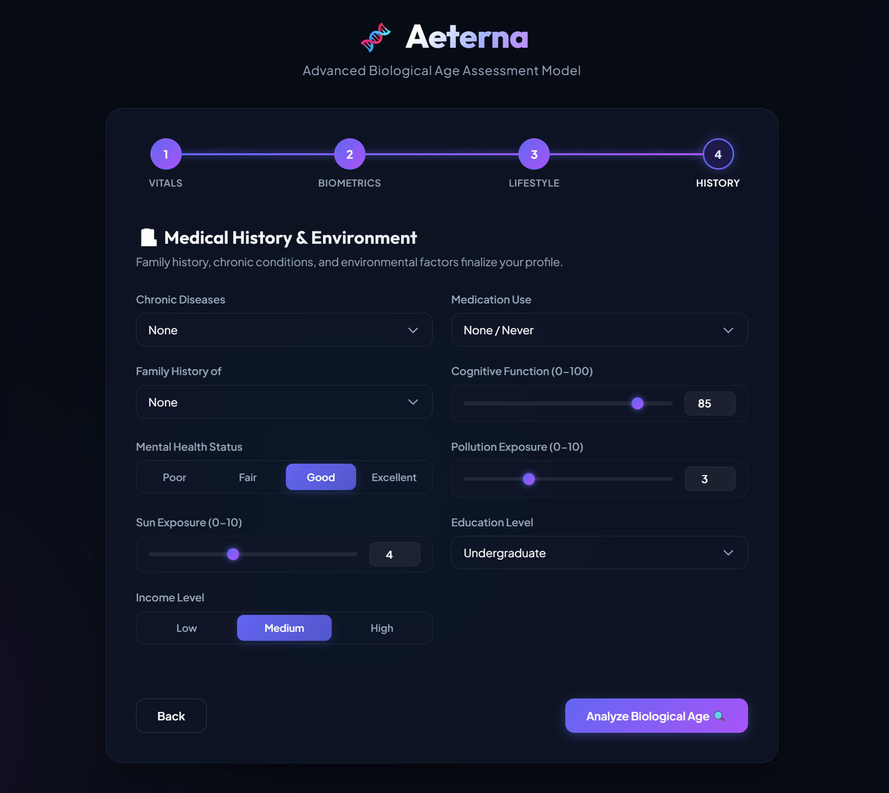
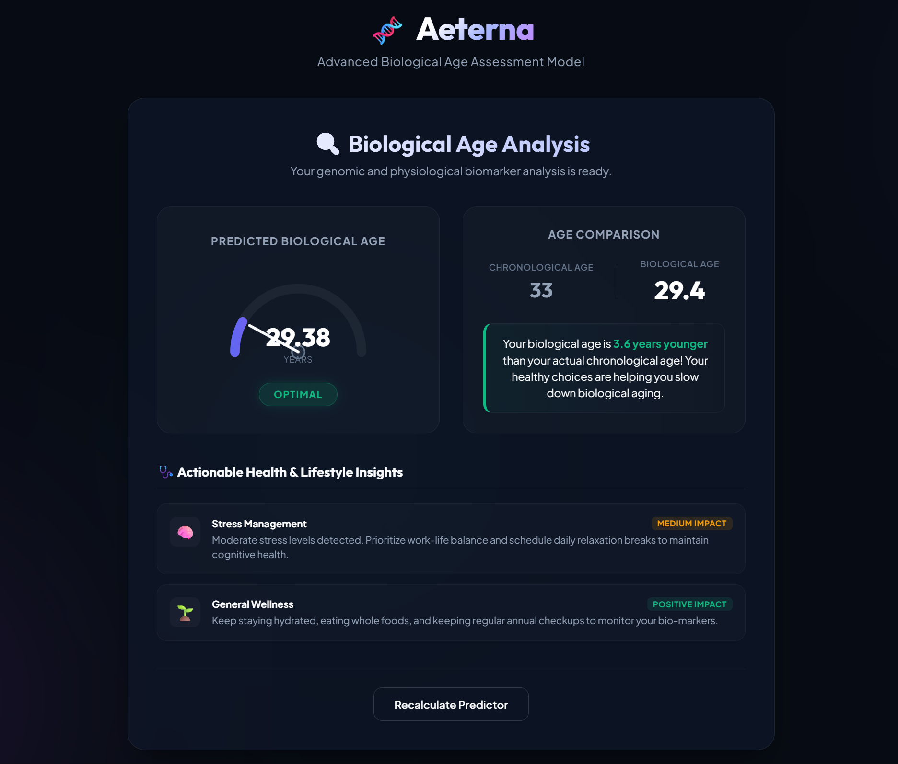

# 🧬 Aeterna | Biological Age Predictor (ML-Powered)

Aeterna is a modern, lightweight, high-fidelity web application that predicts a user's biological age using physiological, clinical, and lifestyle biomarkers through Machine Learning.

Built using a powerful **Stacking Regressor Ensemble** (**Linear Regression + Gradient Boosting + CatBoost**) and deployed with a fast **FastAPI backend**, this project provides a premium biological age analysis experience.

Unlike traditional Streamlit-based ML apps, Aeterna uses a custom **Single Page Application (SPA)** architecture for significantly faster load times and smoother user interaction.

---

## ✨ Features

- **Modern Biotechnology UI** with premium dark-themed glassmorphism design.
- **4-Step Guided Health Assessment Flow** for easier data entry.
- **Automatic BMI Calculation** based on user height and weight.
- **Human-Friendly Inputs** (converts readable values into ML-ready inputs internally).
- **Fast Biological Age Prediction** powered by ensemble learning.
- **Real-time Health Insights Engine** for personalized recommendations.
- **Interactive Final Dashboard** showing biological vs chronological age.
- **Lightweight FastAPI Backend** for fast inference.

---

## 📸 Project Preview

### 1. Basic Vitals


---

### 2. Biometrics & Lab Markers


---

### 3. Lifestyle Analysis


---

### 4. Medical History & Environment


---

### 5. Final Prediction Dashboard


---

## 🛠️ Tech Stack

### Frontend
- HTML5
- CSS3
- Vanilla JavaScript

### Backend
- FastAPI
- Uvicorn

### Machine Learning
- Scikit-learn
- CatBoost
- Pandas
- NumPy
- Joblib

---

## 📦 Project Structure

```text
Biological-Age-Predictor-ML/
│
├── dataset/
│   └── Train.csv
│
├── models/
│   ├── model.pkl
│   ├── scaler.pkl
│   └── encoders.pkl
│
├── static/
│   ├── index.html
│   ├── style.css
│   └── script.js
│
├── images/
│   ├── Vitals.png
│   ├── Biometric.png
│   ├── LifeStyle.png
│   ├── History.png
│   └── Result.png
│
├── app.py
├── predict.py
├── preprocess.py
├── train.py
├── requirements.txt
├── .gitignore
└── README.md
```

---

## 🚀 Getting Started

### Prerequisites

Make sure you have:

- Python **3.8+**
- pip installed

---

### 1. Clone the Repository

```bash
git clone <your-repository-url>
cd Biological-Age-Predictor-ML
```

---

### 2. Install Dependencies

```bash
pip install -r requirements.txt
```

---

### 3. Run the Application

```bash
python app.py
```

Open in browser:

```text
http://localhost:8000
```

---

## 🧠 Machine Learning Model

Aeterna uses an advanced **Stacking Regressor** model:

### Base Models:
- Linear Regression
- Gradient Boosting Regressor
- CatBoost Regressor

### Final Meta Model:
- Linear Regression

---

## ⚙️ Data Processing Pipeline

Before prediction:

- Numerical features are normalized using **StandardScaler**
- Categorical values are converted using **LabelEncoder**
- Human-readable values are transformed internally into model-friendly inputs
- Blood pressure values are split into systolic/diastolic format

This ensures consistency between training and inference.

---

## 📊 Input Parameters Used

The prediction is based on:

- Gender
- Height
- Weight
- BMI
- Blood Pressure
- Cholesterol Level
- Blood Glucose Level
- Bone Density
- Vision Sharpness
- Hearing Ability
- Physical Activity Level
- Smoking Status
- Alcohol Consumption
- Diet Type
- Sleep Pattern
- Stress Level
- Chronic Diseases
- Medication Usage
- Family History
- Cognitive Function
- Mental Health Status
- Pollution Exposure
- Sun Exposure
- Education Level
- Income Level

---

## 🎯 Use Cases

- Personal health monitoring
- Lifestyle improvement tracking
- Biological vs chronological age comparison
- Preventive health awareness
- Educational ML demonstrations

---

## ⚠️ Disclaimer

This project is built for **educational and research purposes only**.

Predictions are generated using machine learning on sample health datasets and should **not** be considered medical advice, diagnosis, or treatment.

Always consult qualified healthcare professionals for actual health decisions.

---

## 👨‍💻 Author

**Shivam Tiwari**